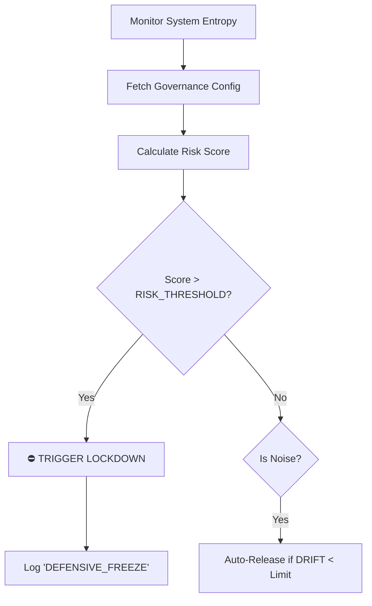
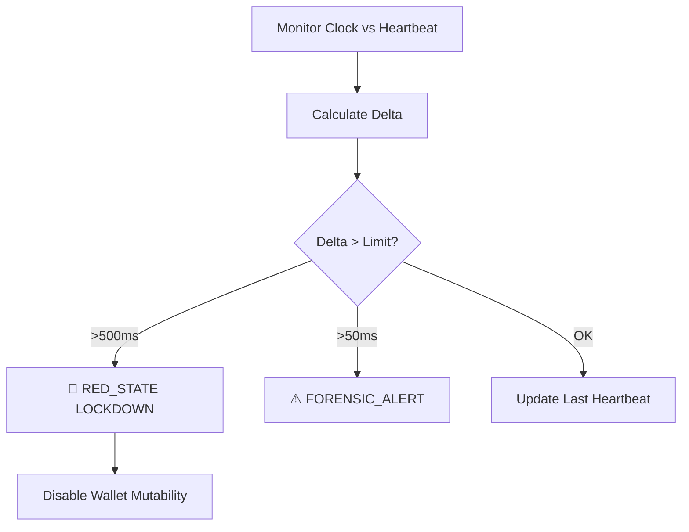

# 🦅 GUAW Operational Governance & IP Audit Manual

> **Classification:** INTERNAL / AUDIT READY
> **Version:** 1.0
> **Date:** 2026-01-08

## 1. Objective

This manual formalizes the **PhaseKernel / Ontological Separation** strategy used to protect GUAW's Intellectual Property. It serves as the primary reference for auditors, legal counsel, and systems architects to understand how the system's "Secret Sauce" is managed separately from the codebase.

---

## 2. Configuration Schema (The "Control Panel")

The following parameters **do not exist** in the repository. They are injected at runtime by the **Governance Service** (via Redis/Secure Env). This separation ensures that possession of the code does not grant possession of the tuned algorithm.

### 🌌 Tier 17: Daemon Factory Config

_Namespace:_ `DAEMON_FACTORY_CONFIG`

| Parameter             | Type  | Description                                   | Sensitivity |
| :-------------------- | :---- | :-------------------------------------------- | :---------- |
| `SI_THRESHOLD`        | Float | Minimum Sovereign Influence req. to spawn AI. | 🔴 HIGH     |
| `EPI_MIN`             | Float | Epigenetic floor (biological integrity).      | 🔴 HIGH     |
| `DAEMON_BOOT_COST`    | Int   | Energy cost (credits) to initialize a daemon. | 🟠 MED      |
| `NEGOTIATION_BASE_MS` | Int   | Base speed in ms for negotiation cycles.      | 🟠 MED      |
| `NEGOTIATION_FACTOR`  | Int   | Scaling factor for speed vs. reputation.      | 🔴 HIGH     |

### 🏰 Tier 16/18: Influence Calculator Config

_Namespace:_ `INFLUENCE_CALCULATOR_CONFIG`

| Parameter        | Type   | Description                                 | Sensitivity |
| :--------------- | :----- | :------------------------------------------ | :---------- |
| `SI_MAX`         | Float  | Hard cap on political weight.               | 🟠 MED      |
| `FRAUD_DECAY`    | Float  | Exponential penalty curve for fraud events. | 🔴 HIGH     |
| `BIO_COEFF`      | Float  | Weight of biological reality vs. trust.     | 🔴 HIGH     |
| `SCALING_FACTOR` | String | Algo type: `SQRT`, `LOG`, `LINEAR`.         | 🟠 MED      |
| `TRUST_MIN`      | Float  | Floor value for trust metrics.              | 🟢 LOW      |

### 🧠 Tier 23: Cortex Guardian Config

_Namespace:_ `CORTEX_CONFIG`

| Parameter                 | Type | Description                                  | Sensitivity |
| :------------------------ | :--- | :------------------------------------------- | :---------- |
| `RISK_THRESHOLD_HIGH`     | Int  | Trigger point for Panic Mode (Lockdown).     | 🔴 HIGH     |
| `RISK_THRESHOLD_MODERATE` | Int  | Trigger for heightened awareness.            | 🟠 MED      |
| `DRIFT_THRESHOLD`         | Int  | Max allowed deviation in system personality. | 🔴 HIGH     |
| `LOCKDOWN_TTL`            | Int  | Max duration (ms) of a defensive freeze.     | 🟠 MED      |

### 💎 Tier 30: Sovereign Time & Finance

_Namespace:_ `SOVEREIGN_DRIVE`

| Parameter              | Type | Description                                | Sensitivity |
| :--------------------- | :--- | :----------------------------------------- | :---------- |
| `DRIFT_LIMIT_CRITICAL` | Int  | Max clock drift (ms) before RED_STATE.     | 🔴 HIGH     |
| `DRIFT_LIMIT_WARNING`  | Int  | Drift threshold (ms) for forensic warning. | 🟠 MED      |
| `FINANCIAL_MODE`       | Str  | `SOVEREIGN` (Hardened) or `LEGACY` (Open). | 🔴 HIGH     |
| `MAX_DEBIT_RETRIES`    | Int  | Retry limit for concurrent financial ops.  | 🟢 LOW      |

---

## 3. Decision Logic & Flows

### 🧬 Daemon Spawning Decision Flow

```mermaid
graph TD
    A[Request: Spawn Daemon] --> B{Fetch Config?};
    B -- No (Offline/Dead) --> C[Load Default/Weak Config];
    B -- Yes (Online/Alive) --> D[Load Secret Production Config];

    C --> E{Check Defaults};
    D --> F{Check Secret Thresholds};

    E -- Pass --> G[Spawn Generic Daemon (Weak)];
    F -- Pass --> H[Spawn Sovereign Daemon (Tuned)];

    G --> I[Log: 'Generic Spawn - IP Not Active'];
    H --> J[Log: 'Sovereign Spawn - IP Active'];
```

### 🛡️ Cortex Immune Response Flow



### ⏰ Temporal Veracity Flow (TimeGuard)



---

### ⚡ PhaseKernel Operations

To transition the system from "Inert Body" to "Living Soul":

#### 1. Ignition (Production Boot)

The `ignite_governance.js` script injects the specialized keys from `PRODUCTION_KEYS_TEMPLATE.json` into Redis, waking up the Living Zone.

```bash
node scripts/ignite_governance.js
```

- **Pre-requisite:** `PRODUCTION_KEYS_TEMPLATE.json` must be configured with real secret values (not samples).
- **Outcome:** Workers exit Safe Mode and begin processing with Production logic.

#### 2. Resilience Simulation (Pre-Flight)

Before any critical deployment, verify that the PhaseKernel architecture is intact:

```bash
node tests/phase_kernel_simulation.js
```

- **Checks:**
  1.  **Safe Mode:** Does system default to safety when configs are missing?
  2.  **Ignition:** Does injection correctly update behavior?
  3.  **Corruption:** Does the Lazarus mechanism respond to signals?

---

## 4. Audit & Verification Protocols

### ✅ Evidence of "Dead Code" (Verification Test)

To prove to an auditor or judge that the code is inert without the secrets:

1.  **Clone Repository** to an isolated "Clean Room" environment.
2.  **Ensure Redis is empty** (No Governance Configs).
3.  **Run `tests/phase_kernel_simulation.js`** (Scenario 1 passes, others fail naturally).
4.  **Result:** System generates "Generic/Safe" scores or enters Lockdown.
5.  **Conclusion:** The Repository alone constitutes an incomplete invention.

### ✅ Evidence of "Living System" (Production Check)

1.  **Connect** to Production Environment.
2.  **Verify Redis Keys** for `gov:config:*` exist.
3.  **Check Heartbeats (Pulses):**
    - `GET worker:integrity:pulse` -> Must return `ACTIVE:...`
    - `GET worker:lazarus:pulse` -> Must return `ACTIVE:...`
4.  **Result:** System is alive, tuned, and utilizing the "Secret Sauce".

### ✅ Evidence of "Autonomous Cycle" (Self-Healing Check)

1.  **Execute the Simulation:**
    ```bash
    npm run test:automation
    ```
2.  **Verify Feedback Loops:**
    - **Detection:** User Silence triggers `RETENTION_RECOVERY`.
    - **Reflection:** Low Confidence triggers `CONSERVATIVE_AUDIT` in Redis.
    - **Action:** Middleware automatically penalizes `effectiveScore` for all users during audits.
    - **Homeostasis:** System restores to 'NORMAL' when confidence is regained.
3.  **New Instincts (v2.4 Roadmap/Activation):**
    - **Risk Escalation:** Pre-emptive audits based on event pattern matching.
    - **Infrastructure Self-Healing:** Auto-restart of degraded workers.
    - **Reward Signals:** Positive reinforcement for high-performing users (Streaks).

---

## 5. Security & Access Governance

1.  **Redis Access:** Strictly limited to `FOUNDER` and `SYSTEM_ADMIN`.
2.  **Config Injection:** Performed only via secure seed scripts (`scripts/seed_governance_secrets.js`) which are **NOT** stored in the git repository (use `.gitignore` or local storage).
3.  **Rotation:** If a leak is suspected, `FRAUD_DECAY` or `SI_THRESHOLD` values are rotated in Redis instantly. No code deployment required.

---

> **Legal Note:** This document demonstrates that GUAW Technologies maintains strict separation between _functional logic_ (Copyrighted Code) and _strategic parametrics_ (Trade Secrets).
